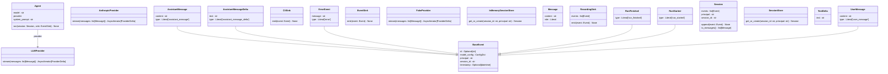

<!-- Generated by core/scripts/gen_diagrams.py — do not edit. Regenerate with `make diagrams`. -->

# Core class diagram

```mermaid
classDiagram
  class Agent {
    model : str
    provider
    system_prompt : str
    run(session: Session, sink: EventSink) None
  }
  class AnthropicProvider {
    stream(messages: list[Message]) AsyncIterator[ProviderDelta]
  }
  class AssistantMessage {
    content : str
    type : Literal['assistant_message']
  }
  class AssistantMessageDelta {
    text : str
    type : Literal['assistant_message_delta']
  }
  class BaseEvent {
    id : Optional[str]
    model_config : ConfigDict
    principal : str
    session_id : str
    timestamp : Optional[datetime]
  }
  class CliSink {
    emit(event: Event) None
  }
  class ErrorEvent {
    message : str
    type : Literal['error']
  }
  class EventSink {
    emit(event: Event) None
  }
  class FakeProvider {
    stream(messages: list[Message]) AsyncIterator[ProviderDelta]
  }
  class InMemorySessionStore {
    get_or_create(session_id: str, principal: str) Session
  }
  class LLMProvider {
    stream(messages: list[Message]) AsyncIterator[ProviderDelta]
  }
  class Message {
    content : str
    role : Literal
  }
  class RecordingSink {
    events : list[Event]
    emit(event: Event) None
  }
  class RunFinished {
    type : Literal['run_finished']
  }
  class RunStarted {
    type : Literal['run_started']
  }
  class Session {
    events : list[Event]
    principal : str
    session_id : str
    append(event: Event) None
    to_messages() list[Message]
  }
  class SessionStore {
    get_or_create(session_id: str, principal: str) Session
  }
  class TextDelta {
    text : str
  }
  class UserMessage {
    content : str
    type : Literal['user_message']
  }
  AssistantMessage --|> BaseEvent
  AssistantMessageDelta --|> BaseEvent
  ErrorEvent --|> BaseEvent
  RunFinished --|> BaseEvent
  RunStarted --|> BaseEvent
  UserMessage --|> BaseEvent
  Agent --> LLMProvider : provider
```
