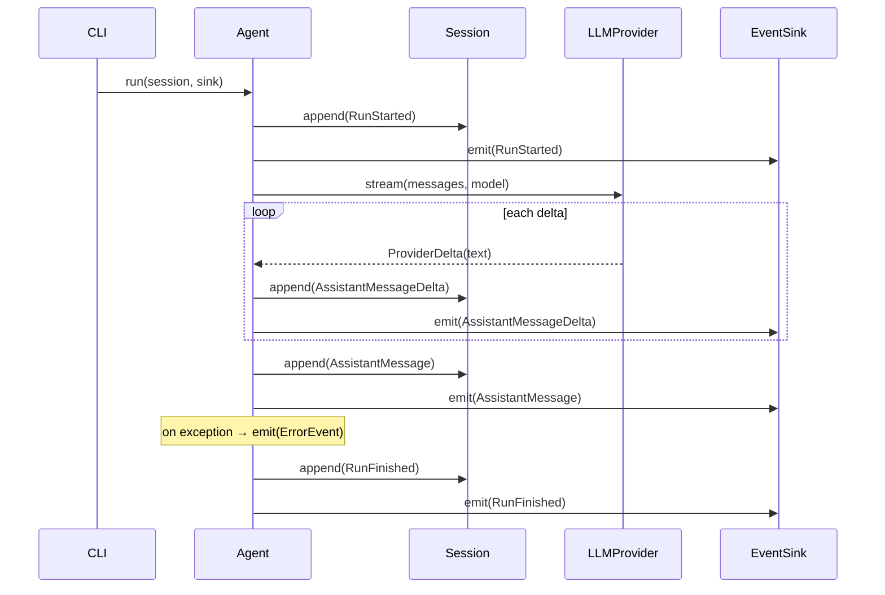

# Echo loop (slice 0.1) — sequence

Hand-authored. The streaming turn: user message in → streamed assistant reply out.
Failures are recorded as an `ErrorEvent` rather than raised (see `Agent.run`).

