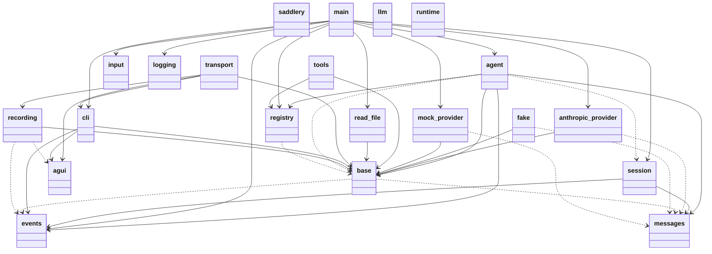

<!-- Generated by backend/scripts/gen_diagrams.py — do not edit. Regenerate with `make diagrams`. -->

# Core package diagram

```mermaid
classDiagram
  class saddlery {
  }
  class agent {
  }
  class cli {
  }
  class input {
  }
  class main {
  }
  class events {
  }
  class llm {
  }
  class anthropic_provider {
  }
  class base {
  }
  class fake {
  }
  class mock_provider {
  }
  class logging {
  }
  class messages {
  }
  class runtime {
  }
  class session {
  }
  class tools {
  }
  class base {
  }
  class read_file {
  }
  class registry {
  }
  class transport {
  }
  class agui {
  }
  class base {
  }
  class cli {
  }
  class recording {
  }
  agent --> events
  agent --> base
  agent --> messages
  agent --> registry
  main --> agent
  main --> input
  main --> events
  main --> anthropic_provider
  main --> mock_provider
  main --> logging
  main --> session
  main --> read_file
  main --> registry
  main --> cli
  anthropic_provider --> base
  fake --> base
  mock_provider --> base
  session --> events
  session --> messages
  tools --> base
  tools --> registry
  read_file --> base
  transport --> agui
  transport --> base
  transport --> cli
  transport --> recording
  cli --> events
  cli --> agui
  cli --> base
  recording --> base
  agent ..> session
  agent ..> base
  anthropic_provider ..> messages
  base ..> messages
  fake ..> messages
  mock_provider ..> messages
  registry ..> base
  base ..> events
  recording ..> events
  recording ..> agui
```
