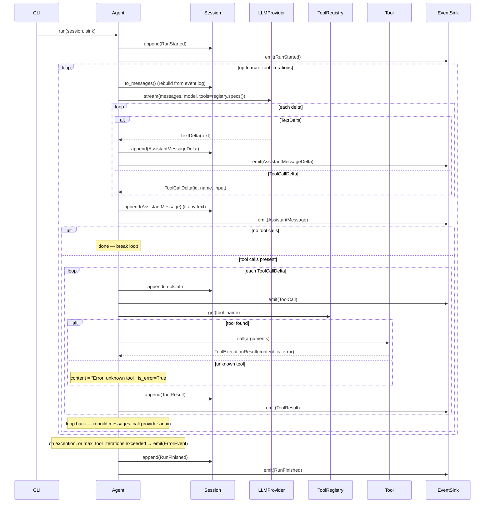

# Tool round-trip (MM-8) — sequence

Hand-authored. `Agent.run()` loops (up to `max_tool_iterations`): stream a turn from the
provider, and if the model asks for tools, execute each one and loop back with the results
appended to the event log. Tool execution never raises — failures become `ToolResult(is_error=True)`,
same as an unknown tool name. Exceeding `max_tool_iterations` emits an `ErrorEvent`; `RunFinished`
always fires (see `Agent.run`).

