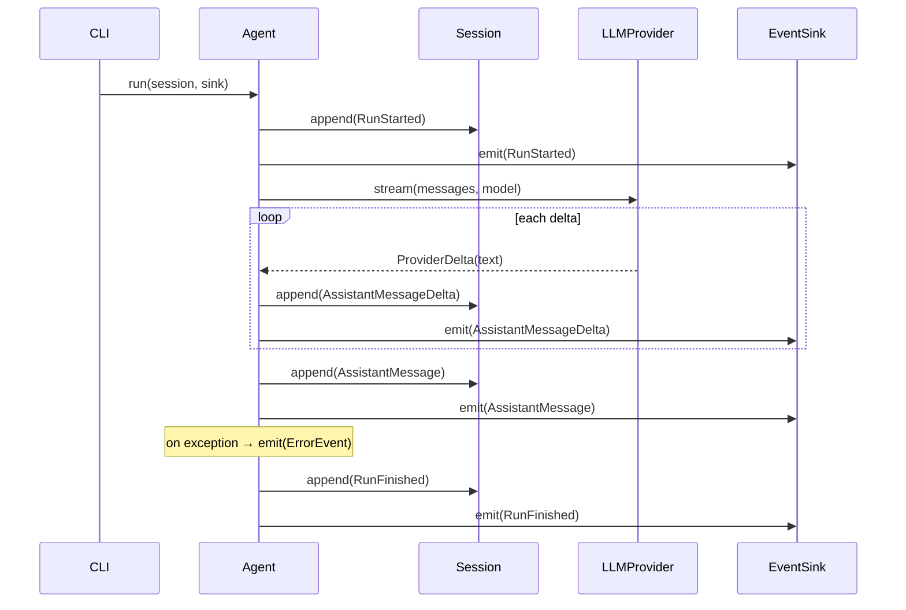

# Mermaid Diagrams Implementation Plan

> **For agentic workers:** REQUIRED SUB-SKILL: Use superpowers:subagent-driven-development (recommended) or superpowers:executing-plans to implement this plan task-by-task. Steps use checkbox (`- [ ]`) syntax for tracking.

**Goal:** Autogenerate a Mermaid class diagram (pyreverse) and data-model ER diagram (custom generator), add a hand-authored echo-loop sequence diagram, and smoke-check generation in CI.

**Architecture:** A dev script `core/scripts/gen_diagrams.py` — split into pure, testable render functions (`render_er`, `render_class_md`) plus an I/O `main()` that shells to `pyreverse` and writes markdown-with-fenced-mermaid under `docs/diagrams/`. Covered by the existing ruff/ty/pytest gate. CI runs the generator as a smoke step (no diff gate).

**Tech Stack:** Python 3.12, uv, pydantic v2, pylint (pyreverse), pytest, ruff, ty, GitHub Actions, make, Mermaid.

**Spec:** `docs/specs/2026-07-02-diagrams-design.md` · **Linear:** [MM-29](https://linear.app/mark-mansour/issue/MM-29/autogenerate-mermaid-diagrams-for-docs-class-sequence)

**Prerequisite (execution setup):** Current branch is local `main` (ahead of origin, not pushed). Do NOT implement on `main`. First create the feature branch:
```bash
cd /Users/markmansour/Documents/Code/agent-saddlery
git checkout -b mark/mm-29-diagrams
```
All `uv` commands run from `core/`.

---

## File map

| File | Action | Responsibility |
|---|---|---|
| `core/pyproject.toml` | Modify | add `pylint` to `dev` group |
| `core/scripts/__init__.py` | Create | make `scripts` importable from tests |
| `core/scripts/gen_diagrams.py` | Create | render functions + `main()` generator |
| `core/tests/test_gen_diagrams.py` | Create | unit-test `render_er` and `render_class_md` |
| `docs/diagrams/class-core.md` | Create (generated) | pyreverse class diagram |
| `docs/diagrams/events-er.md` | Create (generated) | custom ER diagram |
| `docs/diagrams/echo-loop-sequence.md` | Create (hand-authored) | 0.1 echo-loop sequence |
| `docs/diagrams/README.md` | Create | index (generated vs hand-authored + regen command) |
| `Makefile` | Create (repo root) | `diagrams` target |
| `.github/workflows/python-core.yml` | Modify | add generator smoke step |

**Grounding facts (verified 2026-07-02):** `pyreverse -o mmd -p saddlery -d <dir> saddlery` writes `<dir>/classes_saddlery.mmd` starting with `classDiagram` (~82 lines) and a `packages_saddlery.mmd` we ignore. The models in `saddlery/events.py` use `from __future__ import annotations`, so `Cls.__dict__["__annotations__"]` values are **strings** (e.g. `"str"`, `"datetime"`, `"Literal['user_message']"`). The ER entities are `BaseEvent` + its 6 subtypes + `Message`.

---

## Task 1: Add pylint (pyreverse) and the scripts package

**Files:**
- Modify: `core/pyproject.toml` (`dev` group)
- Create: `core/scripts/__init__.py`

- [ ] **Step 1: Add pylint to the dev group**

In `core/pyproject.toml`, change the `dev` group from:

```toml
dev = [
    "pytest>=8",
    "pytest-asyncio>=0.24",
    "ruff>=0.6",
    "ty>=0.0.1",
    "pre-commit>=4",
]
```

to (append `pylint`; keep whatever versions are already present for the others):

```toml
dev = [
    "pytest>=8",
    "pytest-asyncio>=0.24",
    "ruff>=0.6",
    "ty>=0.0.1",
    "pre-commit>=4",
    "pylint>=3",
]
```

- [ ] **Step 2: Sync and confirm pyreverse is available**

Run (from `core/`): `uv sync && uv run pyreverse --help`
Expected: prints pyreverse help (includes `--output`/`-o`).

- [ ] **Step 3: Create the scripts package marker**

Create `core/scripts/__init__.py` with exactly:

```python
"""Developer tooling for the saddlery core (not shipped in the package)."""
```

- [ ] **Step 4: Commit**

```bash
git add core/pyproject.toml core/uv.lock core/scripts/__init__.py
git commit -m "build: add pylint (pyreverse) and scripts package for dev tooling"
```

---

## Task 2: `render_er` — Pydantic models → Mermaid erDiagram (TDD)

**Files:**
- Create: `core/tests/test_gen_diagrams.py`
- Create: `core/scripts/gen_diagrams.py`

- [ ] **Step 1: Write the failing test**

Create `core/tests/test_gen_diagrams.py`:

```python
from __future__ import annotations

from saddlery.events import BaseEvent, ErrorEvent, UserMessage
from saddlery.messages import Message
from scripts.gen_diagrams import render_er


def test_render_er_emits_entities_fields_and_inheritance() -> None:
    out = render_er([BaseEvent, UserMessage, ErrorEvent, Message])

    assert out.startswith("erDiagram")
    # Base entity and its own fields (annotations are strings via __future__).
    assert "BaseEvent {" in out
    assert "str session_id" in out
    assert "datetime timestamp" in out
    # Subtype with its own fields.
    assert "UserMessage {" in out
    assert "str content" in out
    # Inheritance rendered as a relationship to the parent that is also in the list.
    assert "BaseEvent ||--|| UserMessage : \"is a\"" in out
    assert "BaseEvent ||--|| ErrorEvent : \"is a\"" in out
    # A model with no listed parent has no inheritance relation.
    assert "Message {" in out
    assert "|| Message :" not in out


def test_render_er_is_deterministic() -> None:
    models = [BaseEvent, UserMessage, Message]
    assert render_er(models) == render_er(models)
```

- [ ] **Step 2: Run the test to verify it fails**

Run (from `core/`): `uv run pytest tests/test_gen_diagrams.py -q`
Expected: FAIL — `ModuleNotFoundError: No module named 'scripts.gen_diagrams'`.

- [ ] **Step 3: Implement `render_er` (and helpers) in the generator**

Create `core/scripts/gen_diagrams.py`:

```python
"""Generate Mermaid diagrams for the saddlery core.

Pure render functions are unit-tested; `main()` shells to pyreverse and writes
markdown files, and is covered by the CI smoke run.
"""

from __future__ import annotations

import re

from pydantic import BaseModel


def _type_token(annotation: str) -> str:
    """Collapse a (string) annotation into a Mermaid-safe attribute type token."""
    token = re.sub(r"\W+", "_", annotation).strip("_")
    return token or "object"


def _own_annotations(model: type[BaseModel]) -> dict[str, str]:
    """Only the fields declared on `model` itself (not inherited).

    Modules use `from __future__ import annotations`, so values are strings.
    """
    return dict(model.__dict__.get("__annotations__", {}))


def render_er(models: list[type[BaseModel]]) -> str:
    """Render the given models as a Mermaid `erDiagram`.

    Each model becomes an entity listing its own fields; a model whose base is
    also in `models` gets an `is a` relationship to that base.
    """
    listed = set(models)
    lines = ["erDiagram"]
    for model in models:
        lines.append(f"  {model.__name__} {{")
        for name, annotation in _own_annotations(model).items():
            lines.append(f"    {_type_token(annotation)} {name}")
        lines.append("  }")
    for model in models:
        parent = next((b for b in model.__mro__[1:] if b in listed), None)
        if parent is not None:
            lines.append(f'  {parent.__name__} ||--|| {model.__name__} : "is a"')
    return "\n".join(lines) + "\n"
```

- [ ] **Step 4: Run the test to verify it passes**

Run (from `core/`): `uv run pytest tests/test_gen_diagrams.py -q`
Expected: PASS (2 passed).

- [ ] **Step 5: Run the gate**

Run (from `core/`): `uv run ruff check . && uv run ty check`
Expected: `All checks passed!` for both.

- [ ] **Step 6: Commit**

```bash
git add core/scripts/gen_diagrams.py core/tests/test_gen_diagrams.py
git commit -m "feat(scripts): render Pydantic models as a Mermaid erDiagram"
```

---

## Task 3: `render_class_md` + `main()` — generate the diagram files

**Files:**
- Modify: `core/scripts/gen_diagrams.py`
- Modify: `core/tests/test_gen_diagrams.py`
- Create (generated): `docs/diagrams/class-core.md`, `docs/diagrams/events-er.md`

- [ ] **Step 1: Add a failing test for `render_class_md`**

Append to `core/tests/test_gen_diagrams.py`:

```python
from scripts.gen_diagrams import render_class_md  # noqa: E402 - grouped with the tested module


def test_render_class_md_wraps_in_a_fenced_mermaid_block() -> None:
    out = render_class_md("classDiagram\n  class Agent")
    assert "```mermaid" in out
    assert "classDiagram" in out
    assert "do not edit" in out.lower()
    assert out.rstrip().endswith("```")
```

- [ ] **Step 2: Run it to verify it fails**

Run (from `core/`): `uv run pytest tests/test_gen_diagrams.py -q`
Expected: FAIL — `ImportError: cannot import name 'render_class_md'`.

- [ ] **Step 3: Implement `render_class_md`, `main()`, and path/model wiring**

Edit `core/scripts/gen_diagrams.py`. Add imports at the top (after the existing `import re`):

```python
import subprocess
import tempfile
from pathlib import Path

from saddlery.events import (
    AssistantMessage,
    AssistantMessageDelta,
    BaseEvent,
    ErrorEvent,
    RunFinished,
    RunStarted,
    UserMessage,
)
from saddlery.messages import Message
```

Add path + model constants after the imports:

```python
_HERE = Path(__file__).resolve()
CORE_DIR = _HERE.parents[1]
REPO_ROOT = _HERE.parents[2]
DIAGRAMS_DIR = REPO_ROOT / "docs" / "diagrams"

_GENERATED_BANNER = (
    "<!-- Generated by core/scripts/gen_diagrams.py — do not edit. "
    "Regenerate with `make diagrams`. -->"
)

ER_MODELS: list[type[BaseModel]] = [
    BaseEvent,
    UserMessage,
    RunStarted,
    AssistantMessageDelta,
    AssistantMessage,
    RunFinished,
    ErrorEvent,
    Message,
]
```

Add the wrapping + class-diagram + main functions at the end of the file:

```python
def _wrap_md(title: str, mermaid: str) -> str:
    return f"{_GENERATED_BANNER}\n\n# {title}\n\n```mermaid\n{mermaid.strip()}\n```\n"


def render_class_md(mmd: str) -> str:
    """Wrap raw pyreverse Mermaid in a titled, fenced, banner-marked markdown page."""
    return _wrap_md("Core class diagram", mmd)


def _pyreverse_class_mmd() -> str:
    """Run pyreverse over the saddlery package and return its Mermaid class diagram."""
    with tempfile.TemporaryDirectory() as tmp:
        subprocess.run(
            ["pyreverse", "-o", "mmd", "-p", "saddlery", "-d", tmp, "saddlery"],
            cwd=CORE_DIR,
            check=True,
        )
        return (Path(tmp) / "classes_saddlery.mmd").read_text()


def main() -> None:
    DIAGRAMS_DIR.mkdir(parents=True, exist_ok=True)
    (DIAGRAMS_DIR / "class-core.md").write_text(render_class_md(_pyreverse_class_mmd()))
    (DIAGRAMS_DIR / "events-er.md").write_text(
        _wrap_md("Core data model (events + messages)", render_er(ER_MODELS))
    )


if __name__ == "__main__":
    main()
```

- [ ] **Step 4: Run the test to verify it passes**

Run (from `core/`): `uv run pytest tests/test_gen_diagrams.py -q`
Expected: PASS (3 passed).

- [ ] **Step 5: Generate the diagram files**

Run (from `core/`): `uv run python scripts/gen_diagrams.py`
Then: `ls ../docs/diagrams/`
Expected: `class-core.md` and `events-er.md` exist. Open each and confirm it starts with the banner comment and contains a ` ```mermaid ` block (a `classDiagram` and an `erDiagram` respectively).

- [ ] **Step 6: Run the full gate**

Run (from `core/`): `uv run ruff format --check . && uv run ruff check . && uv run ty check && uv run pytest -q`
Expected: formatter clean, ruff `All checks passed!`, ty `All checks passed!`, tests all pass.

- [ ] **Step 7: Commit (code + generated diagrams)**

```bash
git add core/scripts/gen_diagrams.py core/tests/test_gen_diagrams.py docs/diagrams/class-core.md docs/diagrams/events-er.md
git commit -m "feat(scripts): generate class + ER Mermaid diagrams into docs/diagrams"
```

---

## Task 4: Hand-authored sequence diagram + README index

**Files:**
- Create: `docs/diagrams/echo-loop-sequence.md`
- Create: `docs/diagrams/README.md`

- [ ] **Step 1: Write the echo-loop sequence diagram**

Create `docs/diagrams/echo-loop-sequence.md`:

````markdown
# Echo loop (slice 0.1) — sequence

Hand-authored. The streaming turn: user message in → streamed assistant reply out.
Failures are recorded as an `ErrorEvent` rather than raised (see `Agent.run`).


````

- [ ] **Step 2: Write the diagrams index**

Create `docs/diagrams/README.md`:

```markdown
# Diagrams

Mermaid diagrams for the `saddlery` core. They render inline on GitHub and Linear.

| File | Source |
|---|---|
| [class-core.md](class-core.md) | Generated — pyreverse class diagram of `saddlery`. |
| [events-er.md](events-er.md) | Generated — ER diagram of the event models + `Message`. |
| [echo-loop-sequence.md](echo-loop-sequence.md) | Hand-authored — the 0.1 echo-loop sequence. |

## Regenerate

From the repo root:

    make diagrams

which runs `core/scripts/gen_diagrams.py`. Generated files carry a "do not edit"
banner; edit the generator, not the output. Hand-authored diagrams are edited directly.
```

- [ ] **Step 3: Commit**

```bash
git add docs/diagrams/echo-loop-sequence.md docs/diagrams/README.md
git commit -m "docs(diagrams): add echo-loop sequence diagram and index"
```

---

## Task 5: Makefile handle + CI smoke step

**Files:**
- Create: `Makefile` (repo root)
- Modify: `.github/workflows/python-core.yml`

- [ ] **Step 1: Create the Makefile**

Create `Makefile` at the repo root:

```makefile
.PHONY: diagrams

diagrams:
	cd core && uv run python scripts/gen_diagrams.py
```

(Use a real tab for the recipe indentation, not spaces.)

- [ ] **Step 2: Verify the target regenerates cleanly**

Run (from repo root): `make diagrams && git status --short docs/diagrams/`
Expected: the generator runs with exit 0. `git status` shows no changes to the generated files (they were already current from Task 3) — a clean regeneration.

- [ ] **Step 3: Add the CI smoke step**

In `.github/workflows/python-core.yml`, add a step after the existing `pytest` step (same indentation as the other steps, still inside the `check` job's `steps:`):

```yaml
      - name: diagrams (smoke)
        run: uv run python scripts/gen_diagrams.py
```

This runs with the job's `working-directory: core`, so it finds `scripts/gen_diagrams.py`. It must exit 0; output is not diffed.

- [ ] **Step 4: Validate the workflow YAML**

Run (from `core/`): `uv run python -c "import yaml, pathlib; yaml.safe_load(pathlib.Path('../.github/workflows/python-core.yml').read_text()); print('ok')"`
Expected: `ok`. (If PyYAML is absent, confirm by eye that indentation is 2-space and consistent.)

- [ ] **Step 5: Commit and push the branch**

```bash
git add Makefile .github/workflows/python-core.yml
git commit -m "ci: smoke-check diagram generation; add make diagrams handle"
git push -u origin mark/mm-29-diagrams
```

- [ ] **Step 6: Confirm CI is green**

Run: `gh run list --branch mark/mm-29-diagrams --workflow python-core.yml --limit 1`
Then watch the run: `gh run watch <run-id> --exit-status`.
Expected: the `check (3.12)` and `check (3.14)` jobs pass, including the new `diagrams (smoke)` step. If the smoke step fails, capture the error (most likely `pyreverse` not found → confirm Task 1 added `pylint` and `uv sync` ran in CI, or a path issue in `main()`).

---

## Self-review notes

- **Spec coverage:** §3 pyreverse class diagram → Task 3; §3 custom ER generator → Task 2 + Task 3 (`ER_MODELS`, `main`); §3 hand-authored sequence → Task 4; §3 CI smoke-check → Task 5; §3 make handle → Task 5; §4 `render_er`/`render_class_md`/`main` split → Tasks 2-3; §4 unit test → Tasks 2-3; §4 `scripts/__init__.py` → Task 1; §4 pylint dev dep → Task 1; §5 output `.md` files + README → Tasks 3-4; §6 wiring → Task 5; §7 sequence content → Task 4; §8 testing → Tasks 2-3; §9 success criteria → Task 3 Step 6 + Task 5 Step 6.
- **No repo-layout change** and **no `requires-python` change** — none of the tasks touch those.
- **Type consistency:** `render_er(list[type[BaseModel]]) -> str`, `render_class_md(str) -> str`, `_wrap_md(title, mermaid) -> str`, `main() -> None`, `ER_MODELS: list[type[BaseModel]]` — used consistently across Tasks 2-3.
- **Freshness = smoke only:** Task 5 runs the generator in CI without a `git diff` gate, matching the spec decision.
